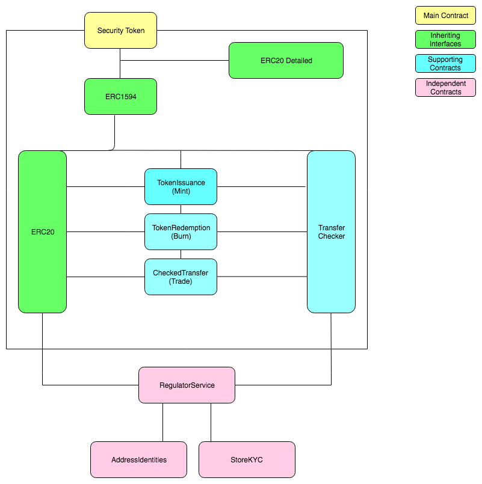

## Overview

Our security token is an instance of an ERC-1594, with additional data mixed in, through `ERC20Detailed` (from Open Zeppelin). Currently ERC-1594 has neither accepted implementation nor full specification. Considering that we have added multiple optimizations while implementing, we believe that our implementation is the best out there. 

Please look at below and `docs/ResearchSTO.md` for more details as to why we have chosen ERC1594 as opposed to other interfaces. Furthemore, the spirit of blockchain is to cultivate open-source protocols and improve existing standards. We are pragramtic in that we care about actual implementation that can be deployed and popularized.

The documents and implementations are only meant for investors to have an understanding about EVG's security token platform Izumi.

## Decision for ERC-1594

This standard seems to be the most reasonable:
- it supports the core functionality:
  - verify transfers
  - verification returns status codes
  - compatible, but not opinionated, on forced actions by regulators etc.
  - minting (issuance: investor gets their tokens)
  - burning (redeeming: investor returns their tokens)
  - transfers (ERC-20 `transfer/transferFrom` override, plus new transfer types)
- supports on-chain data, as well as future use of off-chain data (using `bytes data` parameter in ERC-1594 `transfer/transferFrom-WithData`).
- support issuance based on both investor-initiated (authenticated through `bytes data`) and admin-initiated transactions. 

## Encapsulated Functionality

To keep the contracts easy to maintain, and design towards best-practices for security, a "Mixin" design pattern is implemented.
This pattern is similar to the design choices made in widely used projects like Open-zeppelin, and suits Solidity well.

A "mixin" here is essentially a contract, with some given inherited contracts.
All contracts, that inherit the same contracts, can be combined through C3-linearization, i.e. we "mix" the contracts.
This way, base functionality from super-classes is available across different modules of the security token implementation, while keeping the security token modules encapsulated, and easy to audit.
 
The primary path inherited by security-token modules is: `ERC-20, TransferChecker`.
This enables the modules to check any type of transfer, and make changes in the ERC-20 state when necessary.

## Architecture Designs

Please see `docs/ArchitectureDesign.md` for more specific details for our design chocices. 

## Architecture Visual

We will go through three major functions issuance, redemption, and transfer below. 

## Issuance

Token issuance is implemented as a mixin (see *Encapsulated Functionality*). See `contracts/issuance`.

### Issuers

Issuance is defined as token-minting, by authorized `Issuer`s. Initially, the contract deployer gets issuer rights.
Then, the deployer can assign `Issuer` roles to other addresses, and renounce its own rights.

### Self-issuance

The ERC-1594 interface supports the *reversal*: anyone can call the issuance function,
 and provide a proof (supplied through the `data` parameter) for the contract to verify that they have rights to issue.
 
In the future we imagine this could be beneficial in a more decentralized environment;
 investors could get their issued tokens by themselves, without any intermediary,
 similar to how you would redeem a cheque, but the party accepting the cheque is a smart-contract.

Proof-based self-initiated issuance is interesting, but the initial implementation will focus on UX, 
 and make issued tokens available through the work of an issuer.

### Verification

Issuance is modelled (i.e. no actual transfer, just the description) as a special type of transfer:
 we can verify issuance allowance by asking the regulator if we can transfer a given amount of tokens,
 from address `0x0` to a registered address of the investor.

### Forcing

Issuance is not something that you normally force, but if necessary, a regulator can be granted an issuer role.

### Capacity / limit
The current implementation imposes an issuance-limit: only a certain amount of tokens can be minted.
After this limit is reached, no more tokens can be minted.

### Supply

The token supply is defined by the amount of tokens at a given time, i.e. not the static capacity,
 but the total amount of tokens hold by investors. This behavior is fully inherited from the ERC-20 core.

### Interface

The issuance interface and events are documented in `contracts/issuance/ITokenIssuance.sol`.

## Redemption

Just like issuance, token redemption is also implemented as a mixin. See `contracts/redemption`.

### Redeemers

Whereas issuance is initiated by the issuance administrators (optionally includes regulators),
 redemption is a process initiated by a user, to redeem (i.e. trade in) his tokens, for something else.
Redeeming decreases the supply. Redemption can be seen as "token-burning", but restricted by a regulator.

While redeeming might not be a necessary feature in security, we decided to leave the possibility open.
In the future, we imagine there would be case when regulators have to forcifully burn investors' tokens.
Furthermore, we can also allow investors to burn their tokens independently without the issuer having to transfer each token as in such case of buyback in fiat. 

### Verification

Redemption, just like issuance, is modelled (i.e. no actual transfer, just the description) as a special type of transfer:
 we can verify redemption allowance by asking the regulator if we can transfer a given amount of tokens,
 from the registered investor address to address `0x0`.

Similar to the ERC-20 `transfer` that has a `transferFrom` version for an approved counter-party to initiate transfers,
 `redeem` has a `redeemFrom` version. 
One can approve a `-From` initiated action by a trusted partner/contract through approval and allowance,
 fully compatible with the ERC-20 interface.

### Forcing

Forcing requires an address to be registered as a `Regulator`, in the `RegulatorService` contract.
The Open-zeppelin role system has been adopted here for secure authorized actions.

If the transaction signee (`msg.sender`) address for a `redeemFrom` call is a `Regulator`,
 the verification will allow the action, and the redemption contract will report it as a `ForceRedemption` (emitting a `ForceRedeem` event).

### Interface

The redemption interface and events are documented in `contracts/redemption/ITokenRedemption.sol`.

## Transfers

Transfers are also implemented as a mixin. See `contracts/transfers`.

### Verification

Transfers can be between any two ETH addresses, when allowed by the `RegulatorService`.
The `RegulatorService` however, will keep track of the ETH addresses of each investor (`AddressIdentities`),
 and KYC data (`StoreKYC`). With this data set, 
 it verifies if the `to` and `from` described by the transfer are allowed to transact the given `value`,
  and returns an [EIP-1066](https://eips.ethereum.org/EIPS/eip-1066) status code indicating
  `Allowed or Go` (`0x11`), or `Disallowed or Stop` (`0x10`).

### Forcing

Similar to redemption, forcing is a special case for verification: if it is an address with a `Regulator` role,
 the transfer will be allowed, and reported as a `ForceTransfer`.

## Checks

The `TransferChecker` simply forwards transfer verification requests to the Regulator Service.
This layer in-between the other contracts enables us to upgrade the Regulator Service contract.
This is done by having someone registered with `RegServAppointerRole`,
 call the `changeRegServ(IRegulatorService newRegServ)` function 
 (supplying the address of the new regulator service, which should comply with the regulator service interface).

### Interface

The transfer interface and events are documented in `contracts/transfers/ICheckedTransfers.sol`.

